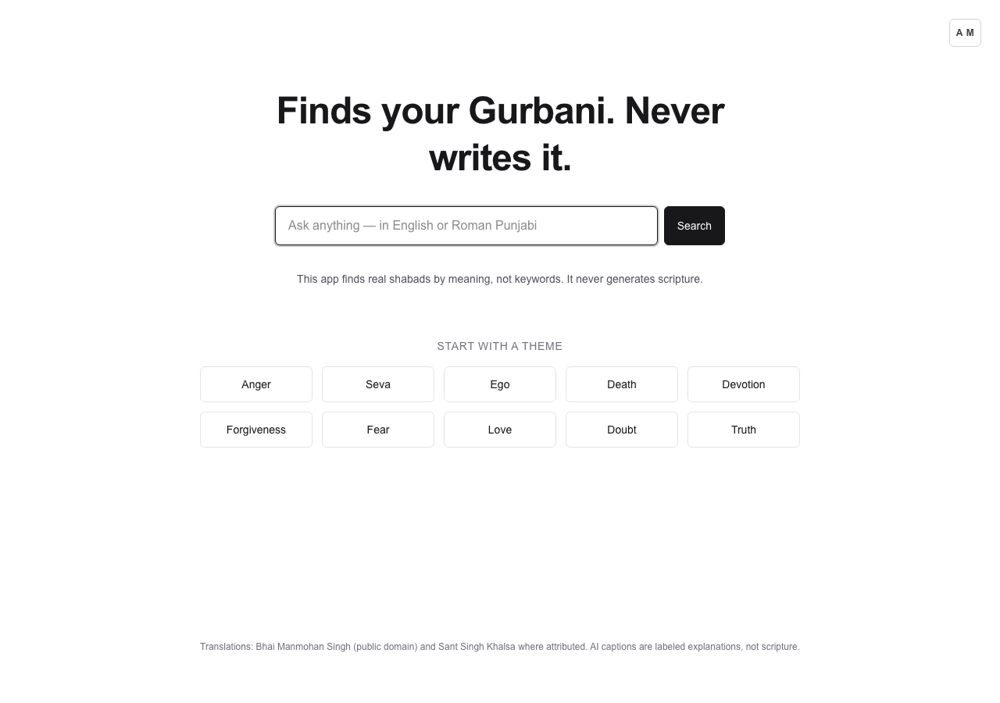
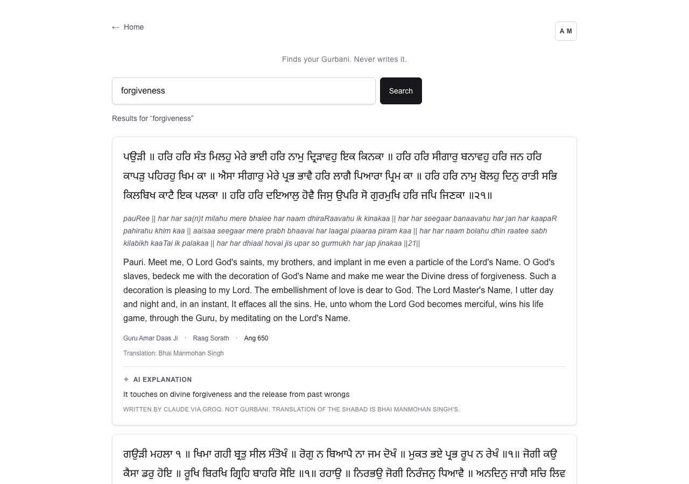
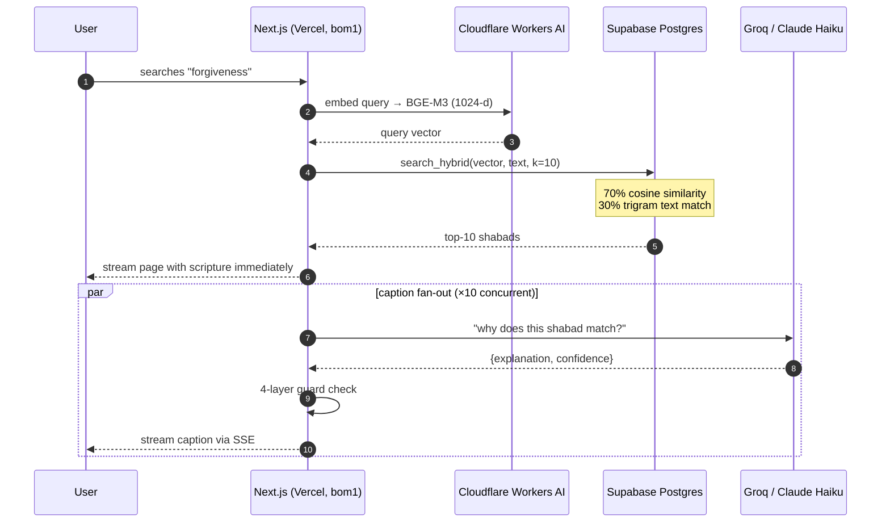
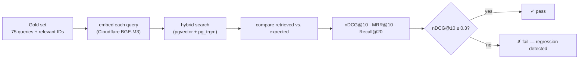

<p align="center">
  <h1 align="center">Gurbani Search</h1>
  <p align="center">
    <strong>Finds your Gurbani. Never writes it.</strong>
    <br />
    Semantic search over the Sri Guru Granth Sahib
    <br /><br />
    <a href="https://gurbani-search-psi.vercel.app"><strong>Try it live</strong></a>
    <br /><br />
    <a href="https://github.com/aman751997/gurbani-search/blob/main/LICENSE"></a>
    
    
    
  </p>
</p>

<p align="center">
  
</p>

---

Most Gurbani search tools match keywords. This one searches by **meaning**.

| | Keyword search (SikhiToTheMax, etc.) | Gurbani Search |
|---|---|---|
| Search "forgiveness" | Finds shabads containing the word "forgiveness" | Finds shabads about *khimaa*, divine mercy, washing sins — even if the word "forgiveness" never appears |
| Search "death" | Literal matches only | Finds shabads about impermanence, the cycle of birth, Kal, and Waheguru's call |
| Search "haumai" | No results (not in English translations) | Finds shabads about ego, self-centeredness, and the five thieves |

Gurbani speaks in metaphor, in Raag, in layers. A keyword search can't follow that. Semantic search can — it embeds your query and the entire SGGS corpus into the same vector space, then finds the shabads closest in concept.

<p align="center">
  
</p>

Every result shows:
- **Gurmukhi** — the original scripture, untouched
- **Transliteration** — Roman-script pronunciation
- **English translation** — by Bhai Manmohan Singh (public domain, SGPC 1962-69)
- **AI explanation** — a short note on *why* this shabad matches your query

The AI only writes the explanation. It never writes, paraphrases, or summarizes Gurbani.

## Why I built this

I grew up in a Sikh family. When you're trying to find what Gurbani says about something you're going through — grief, doubt, anger — you end up on keyword-search tools that only find exact word matches. Gurbani doesn't work like that. It speaks in metaphor, in Raag, in layers.

The existing tools (SikhiToTheMax, iGurbani, SearchGurbani) are all keyword-based. Nobody was doing semantic search. So I built it — a search engine that understands what you *mean*, finds the right shabads, and gets out of the way. No chatbot, no AI guru, no generated scripture. Just search.

## Why "retrieval only"?

The Sikh community takes Gurbani authenticity seriously — and should. A previous AI project was pulled down after it fabricated scripture. The SGPC now has an active AI sub-committee watching this space.

So I treat that as a hard engineering constraint, not a policy footnote. Four layers enforce it:

1. **Type separation** — scripture and AI text flow through different React components with disjoint TypeScript types. You literally can't pass Gurbani into the caption slot.
2. **Schema lock** — the LLM output schema only has `explanation` + `confidence` fields. No slot for scripture to land in.
3. **Runtime guards** — every LLM response passes Zod validation, a Gurmukhi-character detector (zero U+0A00-U+0A7F codepoints allowed in captions), and a substring match against the translation.
4. **Visual separation** — horizontal rule, distinct heading, different typeface, and an explicit "Written by an AI assistant. Not Gurbani." line under every caption.

One fabricated verse in the wrong slot would kill trust permanently.

## How it works



Scripture shows up instantly. AI explanations stream in one-by-one as they're generated.

## Stack

| Layer | Choice | Why |
|---|---|---|
| **App** | Next.js 16 on Vercel Hobby | Single deploy, $0/mo. Pinned to Mumbai for latency. |
| **Embeddings** | BGE-M3 via Cloudflare Workers AI | Best multilingual model for Indic scripts. Free tier. |
| **Search** | Supabase Postgres (pgvector HNSW + pg_trgm) | Hybrid vector + text matching in one query. Free tier. |
| **Captions** | Groq Llama-3.3-70B | Free tier, fast inference. Swappable to Claude Haiku via one env var. |
| **Rate limiting** | Upstash Redis | 30 req/min/IP. Deployed in Mumbai alongside everything else. |
| **Translation** | Bhai Manmohan Singh (96%) | Public-domain SGPC translation (1962-69). ~4% fallback to Sant Singh Khalsa. |

Full semantic search over 5,500 shabads for **~$1/month** — every service above runs on a free tier. The only cost is the domain.

## Retrieval quality

How do you know the search is returning the right shabads? I built an evaluation harness that measures this.

### Gold set

75 queries (50 English + 25 Roman-Punjabi), each with hand-picked relevant shabad IDs:

```yaml
- query: anger
  query_language: english
  relevant: ["2519", "1408", "3722", "94", "73"]
  notes: krodh

- query: forgiveness
  query_language: english
  relevant: ["862", "2089", "4118", "1729", "5332"]
  notes: khimaa / divine mercy

- query: haumai
  query_language: roman-punjabi
  relevant: ["2155", "1706", "2230", "4886", "343"]
  notes: ego — same concept, Punjabi word
```

Each query has 3-5 shabads that are theologically relevant — not just keyword matches. "anger" maps to shabads about *krodh* even if they never use the English word.

### How it's scored

The harness runs all 75 queries through the live pipeline (embed → hybrid search → rank) and compares retrieved results against the gold set using standard information retrieval metrics:



| Metric | What it measures |
|---|---|
| **nDCG@10** | Are the best results ranked highest? (position-weighted) |
| **MRR@10** | How quickly does the first relevant hit appear? |
| **Recall@20** | Did we find all the relevant shabads in the top 20? |

Results are broken down per-query and per-language (English vs. Roman-Punjabi), so I can spot exactly which queries degrade if I change the embedding model, adjust hybrid weights, or modify the search RPC.

**Honesty note:** The gold set was bootstrapped from the system's own output, then hand-verified. This makes it a regression guard, not an independent quality claim. If I swap the embedding model or change the 70/30 dense/lexical weighting, I'll know immediately if retrieval degrades — but the absolute scores are self-referential. See [`eval/`](eval/) for full methodology.

## Design decisions

A few choices that aren't obvious from the code:

- **No query logging.** People search for deeply personal things — grief, doubt, shame. There's no `query_log` table. Vercel runtime logs capture latency and errors only.
- **Gurmukhi font-size control.** The `A S/M/L` button lets users scale Gurmukhi text independently. Not everyone reads Gurmukhi at the same size, and browser zoom scales everything.
- **Starter themes on the homepage.** A blank search box is intimidating when you don't know what to type. The theme grid (Anger, Seva, Ego, Forgiveness...) lowers the barrier to first search.
- **Streaming captions, not blocking.** Scripture loads instantly via SSR. AI explanations stream in via SSE as they generate. You're never waiting on the LLM to see Gurbani.

## What it doesn't do

- Generate, paraphrase, or summarize scripture
- Offer *arth* (authoritative interpretation)
- Accept Gurmukhi-script input (English and Roman-Punjabi only for now)

Gurmukhi-script search and Raag-based browsing are next.

## Run it yourself

Everything runs on free tiers. You'll need 4 accounts (all free, no credit card):

| Service | Sign up | What you'll get |
|---|---|---|
| [Supabase](https://supabase.com) | 2 min | `SUPABASE_URL`, `SUPABASE_ANON_KEY`, `SUPABASE_SERVICE_KEY` |
| [Cloudflare](https://dash.cloudflare.com) | 2 min | `CLOUDFLARE_ACCOUNT_ID`, `CLOUDFLARE_AI_API_TOKEN` |
| [Groq](https://console.groq.com) | 1 min | `GROQ_API_KEY` |
| [Upstash](https://upstash.com) | 1 min | `UPSTASH_REDIS_REST_URL`, `UPSTASH_REDIS_REST_TOKEN` |

Then:

```bash
git clone https://github.com/aman751997/gurbani-search.git
cd gurbani-search
npm install
cp .env.example .env.local   # paste your keys
npm run dev                   # http://localhost:3000
```

Want to use Claude instead of Groq for captions? Set `LLM_PROVIDER=anthropic` + `ANTHROPIC_API_KEY`. Full variable list in [`.env.example`](.env.example).

## Scripts

| Command | What |
|---|---|
| `npm run dev` | Dev server |
| `npm run build` | Production build |
| `npm test` | 362 unit + 2 integration tests |
| `npm run lint` | ESLint |
| `npm run eval:run` | Retrieval quality eval (nDCG, MRR, Recall) |
| `npm run precompute:starter` | Regenerate homepage starter captions |

## Corpus & ingestion

The corpus is the full Sri Guru Granth Sahib (~5,500 shabads) sourced from [BaniDB](https://github.com/KhalisFoundation/banidb-api) (MIT). Ingestion is a one-time, laptop-only Python pipeline:

```
BaniDB API → shabads.jsonl → Cloudflare BGE-M3 embeddings → Supabase bulk load
```

Scripts live in `ingestion/`. The deployed app never writes to the database — it's read-only by design.

## Attribution

- **Corpus** — [BaniDB](https://github.com/KhalisFoundation/banidb-api) by Khalis Foundation (MIT)
- **Translation** — Bhai Manmohan Singh (SGPC, 1962-69, public domain equivalent). ~4% fallback to Sant Singh Khalsa where attributed.
- **Font** — Noto Sans Gurmukhi (SIL Open Font License)
- **Embeddings** — BGE-M3 by BAAI (MIT)

## License

MIT. See [LICENSE](LICENSE).
