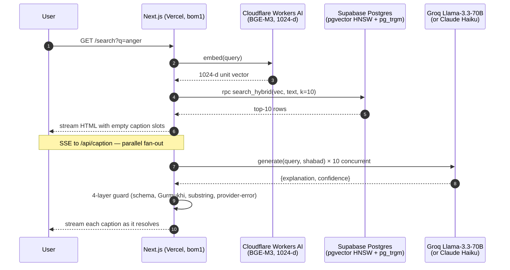

# Gurbani Search

> **Finds your Gurbani. Never writes it.**

Semantic search over Sri Guru Granth Sahib. Type a concept — `anger`, `haumai`, `forgiveness`, `krodh` — and get ranked shabads with Gurmukhi, transliteration, English translation, and a short AI-generated note explaining why each result matches your query.

All scripture comes verbatim from the database. The AI only writes the match explanation, never the scripture itself.

<!-- TODO: drop real screenshots into docs/screenshots/ -->

## How it works



The mermaid diagram above covers the full request flow.

## Stack

| Layer | Choice | Why |
|---|---|---|
| **App** | Next.js 16 on Vercel (Hobby) | Single deploy. Python only used locally for one-time corpus ingestion. Pinned to Mumbai (`bom1`) to keep Upstash + Supabase latency under 10ms. |
| **Embeddings** | BGE-M3 via Cloudflare Workers AI | Best multilingual embedding model for Indic scripts at 1024-d. Same endpoint for ingestion and queries — no cosine drift. Free tier covers this traffic easily. |
| **Captions** | Groq Llama-3.3-70B (default) | Free tier, JSON-mode structured output. Swappable to Claude Haiku via `LLM_PROVIDER=anthropic`. |
| **Translation** | Bhai Manmohan Singh (96%), Sant Singh Khalsa (4%) | Bhai Manmohan Singh's SGPC translation (1962-69) is public-domain-equivalent. Tracked per-row via `translation_source`. |
| **Rate limiting** | Upstash Redis | |
| **Database** | Supabase Postgres (pgvector + pg_trgm) | Hybrid search: vector similarity + trigram text matching. |

## Why "retrieval only"

The Sikh community has a hard line on Gurbani authenticity. A previous AI project (KhalsaGPT) was pulled down after it fabricated scripture. The SGPC now has an active AI sub-committee watching this space.

I treat that as a design constraint, not a suggestion. Four layers enforce it:

1. **Separate components** — `ScriptureBlock` and `CaptionBlock` have disjoint prop types. TypeScript won't let scripture strings flow into caption slots or vice versa.
2. **Schema enforcement** — LLM output only has `explanation` + `confidence` fields. No slot exists for scripture text to land in.
3. **Runtime guards** — Every LLM response passes through Zod validation, a Gurmukhi-character check (zero U+0A00-U+0A7F codepoints allowed), and a 7-token substring match against the translation. Any failure falls back to a neutral "No AI explanation for this shabad" message.
4. **Visual separation** — Horizontal rule, distinct heading with robot icon, different typeface, and "Written by an AI assistant. Not Gurbani." attribution line.

Overkill? Maybe. But one leaked paraphrase in the wrong slot would kill trust permanently.

## What it doesn't do

- Generate, paraphrase, or summarize scripture
- Offer *arth* (authoritative interpretation)
- Log queries — people search for deeply personal things (grief, doubt, shame). There's no `query_log` table.
- Accept Gurmukhi-script input (English and Roman-Punjabi only for now)

## Getting started

```bash
npm install
cp .env.example .env.local     # fill in your keys
npm run dev                    # http://localhost:3000
```

You'll need these in `.env.local`:

| Variable | Source |
|---|---|
| `SUPABASE_URL`, `SUPABASE_ANON_KEY`, `SUPABASE_SERVICE_KEY` | [Supabase](https://supabase.com) |
| `CLOUDFLARE_ACCOUNT_ID`, `CLOUDFLARE_AI_API_TOKEN` | [Cloudflare](https://dash.cloudflare.com) |
| `GROQ_API_KEY` | [Groq](https://console.groq.com) |
| `UPSTASH_REDIS_REST_URL`, `UPSTASH_REDIS_REST_TOKEN` | [Upstash](https://upstash.com) |

Or set `LLM_PROVIDER=anthropic` + `ANTHROPIC_API_KEY` to use Claude instead of Groq. Full list in [`.env.example`](.env.example).

## Scripts

| Command | What |
|---|---|
| `npm run dev` | Dev server |
| `npm run build` | Production build |
| `npm test` | Vitest (362 unit + 2 integration) |
| `npm run lint` | ESLint |
| `npm run format` | Prettier |
| `npm run precompute:starter` | Regenerate homepage starter captions |
| `npm run eval:run` | Run retrieval eval, write report to `eval/results/` |

## Eval

```bash
npm run eval:run
```

Current eval scores (nDCG@10, MRR@10, Recall@20) are all 1.0 — but read that skeptically. The gold set is bootstrapped from the pipeline's own output, so it's self-consistent by construction, not independently validated. The harness exists so better gold-set entries can be added over time. See [`eval/README.md`](eval/README.md) for methodology.

## Attribution

- **Corpus** — [BaniDB](https://github.com/KhalisFoundation/banidb-api) by Khalis Foundation (MIT)
- **Translation** — Bhai Manmohan Singh (SGPC, 1962-69, public domain equivalent). ~4% fallback to Sant Singh Khalsa.
- **Font** — Noto Sans Gurmukhi (SIL Open Font License)
- **Embeddings** — BGE-M3 by BAAI (MIT)

## License

MIT. See [LICENSE](LICENSE).
