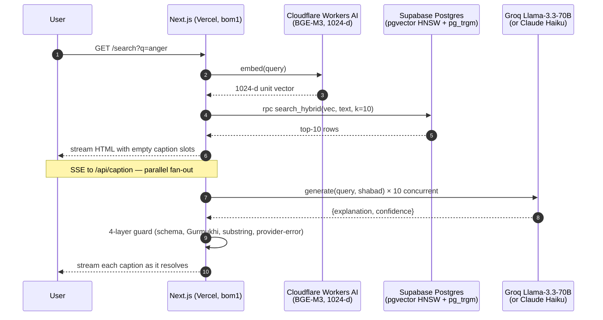

# Gurbani Search

> **Finds your Gurbani. Never writes it.**

Semantic search across the Sri Guru Granth Sahib (SGGS). Type a concept in English or Roman-script Punjabi — `anger`, `haumai`, `forgiveness`, `krodh` — and get ranked shabads with Gurmukhi, transliteration, English translation, and a short AI-written "why this matches" note that explains the *connection* between your query and each shabad without paraphrasing scripture.

The single non-negotiable design rule: **retrieval only, never generation** of scripture.

## Screenshots

Placeholders — the UI is intentionally minimal in v1.0; a UX-polish pass is queued for v1.0.x driven by soft-launch feedback. Capture and drop the real files into `docs/screenshots/` during the launch checklist (see `docs/launch/v1.0-checklist.md` step 4).

- `docs/screenshots/home.png` — homepage with tagline + 10-tile starter grid + search input.
- `docs/screenshots/search.png` — search results for "anger" showing 10 cards, each with Gurmukhi / transliteration / English / AI explanation separated by a horizontal rule and an "AI explanation — not Gurbani" attribution line.
- `docs/screenshots/shabad.png` — detail page at `/shabad/<id>` with full shabad + Ang / author / raag metadata.

## What it is / what it doesn't do

**What it is.** A concept-level search tool over the canonical, community-vetted English translation (Bhai Manmohan Singh) and the Gurmukhi text of the SGGS. The LLM's only job is to translate the *query intent* into a short match explanation. The displayed scripture is verbatim from the database.

**What it doesn't do.**

- It does not generate, paraphrase, or summarize scripture. Ever.
- It does not offer *arth* (authoritative interpretation).
- It does not claim spiritual authority or completeness.
- It does not log your queries. There is no `query_log` table — user queries may contain deeply personal religious content (grief, doubt, shame) and storing them indefinitely is inconsistent with the trust posture of the rest of the project.
- It does not support Gurmukhi-script input in v1.0 (queries are English or Roman-Punjabi only).

This product is shaped by the community context around prior AI attempts. The SGPC has an active AI sub-committee. The one prior attempt (KhalsaGPT) was pulled down after it was caught fabricating scripture. There is a clear community red line: retrieval of authentic shabads is welcome, generation of scripture is not. The app architecture makes that line structural — see the render-path separation contract below.

## Architecture (short version)



The full flow + render-path separation contract + data model is in [`docs/architecture.md`](docs/architecture.md).

## Stack rationale

**Next.js 16 on Vercel (Hobby, `bom1`).** Monolithic deploy; single thing to push. No separate Python backend in production — Python is only used locally for one-time corpus ingestion. Pinned to Mumbai via `vercel.json` so rate-limit checks to Upstash (ap-south-1) and Supabase (ap-south-1) stay under 10 ms.

**BGE-M3 on Cloudflare Workers AI.** BGE-M3 is the best general-purpose multilingual embedding model for Indic scripts at ≤1024 dimensions. Using it via Cloudflare Workers AI eliminates the cosine-drift problem that would come from embedding the corpus with one model and queries with another — ingestion *and* query both call the identical endpoint. Free tier (10k neurons/day) is comfortably above portfolio traffic.

**Groq Llama-3.3-70B for captions, dev default.** Groq's free tier lets you prototype the caption feature with zero money risk. JSON-mode structured output gives deterministic schema enforcement without tool-use gymnastics. A Dev-Tier (paid) upgrade is only needed if the daily 100k-token cap becomes a real issue — for the portfolio traffic this app expects, it won't.

Why not Anthropic from day 1? Two reasons. First, a free provider is the right default for a side project while the caption prompt and guards are still being tuned. Second, an `LLMProvider` abstraction lets production flip to Claude 4.5 Haiku by changing one env var (`LLM_PROVIDER=anthropic`) — a real multi-provider architecture is an honest resume-line signal and a realistic hedge against any single provider's free-tier policies changing.

**Bhai Manmohan Singh translation over Sant Singh Khalsa.** Bhai Manmohan Singh's translation (SGPC, 1962–1969) is public-domain-equivalent; starter captions are committed to git and Git history is irreversible, so license-redistribution risk on the translation text has to be zero from day 1. The register is slightly more formal than SSK — judged acceptable for the sacred-text context.

BaniDB ships Bhai Manmohan Singh (`ms`) for ~96% of SGGS; the remaining ~4% (11 shabads in the current corpus) fall back to Sant Singh Khalsa (`ssk`). The `translation_source` column attributes each row. UI attribution will pick up this distinction when the result card's "source" chip is implemented in v1.0.x.

## Honest eval

The latest retrieval evaluation sits at [`eval/results/2026-04-22-1534.md`](eval/results/2026-04-22-1534.md). The headline numbers on 75 queries:

| Metric | Value |
|---|---:|
| Mean nDCG@10 | 1.0000 |
| Mean MRR@10 | 1.0000 |
| Mean Recall@20 | 1.0000 |

**Read this skeptically.** The gold set is bootstrapped — for each seed query, we ran the live hybrid retrieval pipeline once and recorded its top-k shabads as the "relevant" set. Evaluating the same pipeline against that set is tautological: the retrieval is, by construction, perfect on its own generated labels. The 1.0 row means the pipeline is *self-consistent*, not that it's *right*. See [`eval/README.md`](eval/README.md) for the full methodology and the caveats that the report is honest about.

The point of committing the 1.0 run to the repo is not to claim victory but to:

1. establish the harness (nDCG / MRR / Recall@k implementations are in `eval/metrics.ts`, unit-tested with synthetic ground truth);
2. make the tautology visible so community PRs to the gold set are not papering over a half-broken pipeline;
3. give contributors a concrete, grep-able target for gold-set refinement.

The honest way to move this number into something that proves retrieval quality is: **solicit community PRs against `eval/gold-set.yaml` that add human-authored `relevant: [...]` lists independent of the pipeline.** That request is open. See *Contributing* below.

## Local development

```bash
npm install
cp .env.example .env.local     # fill in your own secrets — see below
npm run dev                    # http://localhost:3000
```

Environment variables you need in `.env.local` for a working local dev server:

- `SUPABASE_URL`, `SUPABASE_ANON_KEY`, `SUPABASE_SERVICE_KEY`
- `CLOUDFLARE_ACCOUNT_ID`, `CLOUDFLARE_AI_API_TOKEN`
- `GROQ_API_KEY` (or `ANTHROPIC_API_KEY` with `LLM_PROVIDER=anthropic`)
- `UPSTASH_REDIS_REST_URL`, `UPSTASH_REDIS_REST_TOKEN`

Full list and comments are in [`.env.example`](.env.example).

## Scripts

| Command | What it does |
|---|---|
| `npm run dev` | Next.js dev server. |
| `npm run build` | Production build. |
| `npm run start` | Run the production build. |
| `npm run lint` | ESLint (Next.js + Prettier-compat). |
| `npm run format` | Prettier write. |
| `npm test` | Vitest: 362 unit + 2 opt-in integration (skipped by default). |
| `npm run precompute:starter` | Re-generate `data/starter-captions.json` for the 10 homepage starter queries. Delays 1500 ms between real Groq calls. |
| `npm run eval:bootstrap` | (one-shot) Bootstrap `eval/gold-set.yaml` from the live pipeline. |
| `npm run eval:run` | Run the harness against the gold set and write a timestamped markdown report to `eval/results/`. |

Two operator-only scripts you may need during launch ops:

- `npx tsx scripts/audit_starter_captions.ts` — writes `docs/launch/caption-audit.md` (heuristic scan of the 100 committed captions).
- `npx tsx --require ./scripts/_server_only_register.cjs scripts/clear_guard_markers.ts` — deletes `explanation=''` rows from `caption_cache` so a subsequent `precompute:starter` run retries those pairs against the live LLM.

## Running the eval

```bash
npm run eval:run
```

Writes `eval/results/YYYY-MM-DD-HHMM.md`. Per the honest-eval section above, the current gold set is bootstrapped and therefore produces a tautological 1.0 — use the timestamp as a reproducibility marker, not a score.

To add or refine a gold-set entry, open [`eval/gold-set.yaml`](eval/gold-set.yaml) and amend the `relevant:` list for a given query with shabad IDs you have independently judged to match. PRs welcome.

## Attribution

- **Corpus.** BaniDB by Khalis Foundation (MIT). See <https://github.com/KhalisFoundation/banidb-api>. The seed data in this repo is derived from BaniDB's public API.
- **English translation.** Bhai Manmohan Singh (SGPC, 1962–1969, public-domain-equivalent status). Used for ~96% of shabads. The remaining ~4% fall back to Sant Singh Khalsa (used under fair-use provisions; attributed in the `translation_source` column).
- **Fonts.** Noto Sans Gurmukhi (SIL Open Font License).
- **Embeddings.** BGE-M3 by BAAI (MIT). Hosted on Cloudflare Workers AI.

## Retrieval only, never generation — community context

This project sits downstream of a very specific history. The Sikh community maintains a hard line on authenticity of Gurbani. A recent AI attempt (KhalsaGPT) was caught fabricating scripture-shaped output and pulled down amid community backlash. The SGPC has since convened an active AI sub-committee.

We take that red line as a product constraint. The app is architected around four concentric defenses against any accidental generation of scripture:

1. **Structural:** `ScriptureBlock` and `CaptionBlock` are separate components with disjoint prop types. `ScriptureBlock` fetches its data by `shabadId` from the database; it cannot receive caption strings. `CaptionBlock` accepts only `{ explanation: string | null, confidence }`; it cannot receive scripture. TypeScript catches any prop-routing bug at compile time.
2. **Schema:** The LLM's structured output has only `explanation` and `confidence` fields — no slot for scripture text. There is nowhere in the response for a hallucinated shabad to land.
3. **Runtime guards:** The caption pipeline runs three checks on every LLM response — (a) Zod schema validation, (b) a Gurmukhi-character guard (caption must contain zero codepoints in U+0A00–U+0A7F), (c) a per-target 7-token substring guard against the translation. Any trigger substitutes the neutral "No AI explanation for this shabad" slot, not a templated fallback that would itself be generated text.
4. **Reader-facing separation:** A horizontal rule, a distinct heading (*"AI explanation"* with a robot icon), a distinct typeface, and an attribution line (*"Written by an AI assistant. Not Gurbani."*) make the line visible to a user who has never seen the codebase.

This is defense-in-depth because the failure mode is unforgiving — a single bug that lets a paraphrased line through in the wrong slot would erase the community-trust premise the product rests on. Multiple layers also mean any single layer can be relaxed for a good reason (e.g., to enable a brief attributed paraphrase in v1.1) without collapsing the whole contract.

## Contributing

Two specific PRs are welcome and wanted:

1. **Eval gold-set refinement.** Open `eval/gold-set.yaml`. For any query where you disagree with the bootstrapped `relevant:` list, replace it with your own human-judged list (or add a new query). PRs should include a one-line note in the `notes:` field explaining the choice.
2. **Caption sign-off and replacement.** `data/starter-captions.json` is the 100-caption homepage corpus. If you read a caption that paraphrases, over-interprets, or feels authoritative, open a PR replacing its `explanation` with either a safer version or `null` (with `confidence: "low"`, `source: "guard"`, `guardTriggered: "manual-review"`).

For everything else (v1.1 features, UX polish, new filters) please open an issue first so we can align on scope.

## Roadmap

**v1.0 (this release).** Homepage + search + shabad detail + AI captions with render-path separation, committed to `main` under the `U13` tag. See [`docs/plans/2026-04-21-001-feat-gurbani-semantic-search-v1-plan.md`](docs/plans/2026-04-21-001-feat-gurbani-semantic-search-v1-plan.md) for the full plan.

**v1.0.x (UX polish, soft-launch-driven).** Loading-state pulse during SSE streaming, share / copy buttons on result cards, match-highlights in results, Gurmukhi typography polish (shirorekha line-height, mobile sizing), visual hierarchy by rank, keyboard arrow-nav, sacred-text tone palette, first-run orientation banner. Priority order is driven by real soft-launch feedback, not speculation.

**v1.1.** Adjacent shabads on the detail page; author + raag filters on search; offline PWA with corpus cache; public Langfuse trace dashboard.

## License

MIT. See [LICENSE](LICENSE). Corpus data sourced from BaniDB (also MIT-licensed by Khalis Foundation).
