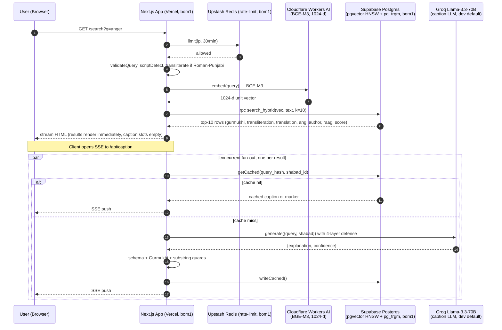

# Architecture — gurbani-search

This document shows how a search request flows through the system end-to-end, the data that each layer persists, and the explicit boundary between retrieval (which we do) and generation (which we do not do with respect to scripture).

## High-level request flow



Steps 1–10 are the **retrieval path**. The response the user sees contains scripture text that was written verbatim to Postgres during ingestion. Nothing in this path ever asks an LLM to produce scripture.

Steps 11–17 are the **caption path**. The LLM sees one shabad's English translation and the user's query, and returns a short "why this matches" explanation. The output schema contains only `{explanation, confidence}` — no field for scripture text.

## Render-path separation (R3)

The components that render scripture and captions are structurally distinct. Their prop types make it a compile error to pass caption strings to scripture slots or vice versa.

```
ResultCard (composer)
├── ScriptureBlock        props = { shabadId: string }
│   ├── Gurmukhi text     ← column shabads.gurmukhi_display
│   ├── Transliteration   ← column shabads.transliteration
│   └── English           ← column shabads.translation_bms
│
└── <hr/>  + "AI explanation" heading + robot icon
    │
    └── CaptionBlock      props = { explanation: string | null, confidence: 'high'|'medium'|'low' }
        ├── never receives shabad_id
        ├── never receives scripture text
        └── renders "No AI explanation for this shabad" when explanation is null
```

A runtime guard in `lib/caption.ts` layers four defenses (schema, Gurmukhi-character, per-target substring, and provider-error) on top of the structural separation. Any trigger produces `{ explanation: null, guardTriggered: <reason> }` which surfaces as the neutral empty-slot rendering.

## Data model

| Table | Purpose | Write path |
|---|---|---|
| `shabads` | Canonical SGGS corpus (~5,500 shabads), one row per shabad. Columns: gurmukhi, gurmukhi_display, transliteration, translation_bms, translation_source, ang, author, raag, line_count. | Populated once by the Python ingestion pipeline (`ingestion/`) from BaniDB. Never mutated by the app. |
| `shabad_embeddings` | `halfvec(1024)` BGE-M3 vectors, one row per shabad. HNSW index with `m=16, ef_construction=64`, cosine opclass. | Populated once by the ingestion pipeline. Never mutated by the app. |
| `caption_cache` | `(query_hash, shabad_id) → {explanation, confidence}`. Stores live captions for reuse. A row with `explanation=''` is a guard-marker — the pair was attempted but rejected. | Server-side only, via the service_role key. Row writes are idempotent upserts. |

There is **no `query_log` table**. User queries may contain deeply personal religious content (grief, doubt, shame). Storing them indefinitely in plaintext without a privacy policy is inconsistent with the community-trust posture of the rest of the project. Latency and error metrics are captured via Vercel runtime logs only.

## External services

| Service | Role | Region | Why this provider |
|---|---|---|---|
| **Vercel** | Next.js 16 runtime — App Router, Edge middleware, Edge routes for SSE. | `bom1` (Mumbai) | Free Hobby tier; pinned to Mumbai to colocate with Supabase + Upstash. |
| **Supabase** | Postgres 15 + pgvector 0.7 + pg_trgm, RLS enforced. | `ap-south-1` | Free tier covers our corpus size. pgvector HNSW is the shortest path from BGE-M3 vectors to top-k retrieval. |
| **Cloudflare Workers AI** | BGE-M3 embedding inference (`@cf/baai/bge-m3`), query-time only. | Auto | Free tier. BGE-M3 is the best general-purpose multilingual model for Indic scripts at ≤1024 dim. |
| **Groq** (dev default) | Llama-3.3-70B for caption generation. JSON-mode structured output. | Auto | Free tier (100k TPD). Swap to Anthropic Claude 4.5 Haiku in production via `LLM_PROVIDER=anthropic`. |
| **Upstash Redis** | Per-IP rate limiting via `@upstash/ratelimit`. | `ap-south-1` | Free tier. Colocated with Vercel to keep rate-limit check overhead under 10ms. |

## Latency budget

- First result card rendered: target ≤ 1s from submit (embed + DB + initial HTML).
- All 10 captions streamed in: target ≤ 2.5s (10 parallel LLM calls, slowest ~2s).
- Cold HNSW index (first query of the day on the Supabase free tier): up to ~5s. The `anon` role's statement_timeout is raised to 10s via migration `0003_raise_anon_timeout.sql` so this does not produce a user-visible 503.

## Failure modes

| Layer failure | User-visible behavior |
|---|---|
| Rate limit exceeded (`/api/search`) | 429 with `Retry-After`. |
| Query validation failure | 400 with a specific reason (`too_long`, `control_character`, `injection_sigil`, etc.). |
| Cloudflare embeddings unavailable | 503 on `/api/search`; the search page renders the error state with a retry button. |
| Supabase cold-start or timeout | Up to 10s wait, then a legitimate retrieval; beyond that, 503. |
| Caption LLM error / guard trigger | The individual result card keeps its scripture, and the caption slot renders "No AI explanation for this shabad". The result page does not degrade. |
| Caption SSE stream drops | Already-pushed captions remain; the remaining slots fall back to the no-explanation state. |

## Invariants

- **All displayed Gurmukhi comes verbatim from `shabads.gurmukhi_display`.** No code path in the app mutates, transforms, paraphrases, or re-renders this text through an LLM.
- **Caption output never includes scripture fields.** The JSON schema the LLM responds with has only `explanation` and `confidence`; the scripture text is passed in as *context* in the prompt, never requested as part of the structured output.
- **Caption row rendering is structurally distinct from scripture rendering.** A separate React component, a separate Postgres column, a separate template slot, and a visible horizontal rule plus AI-attribution label between them.
